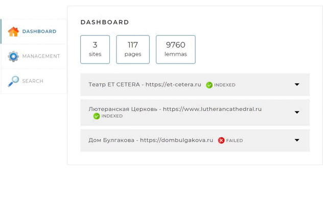
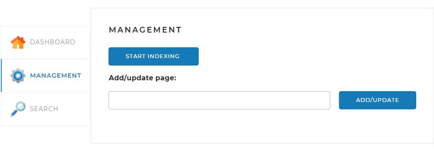
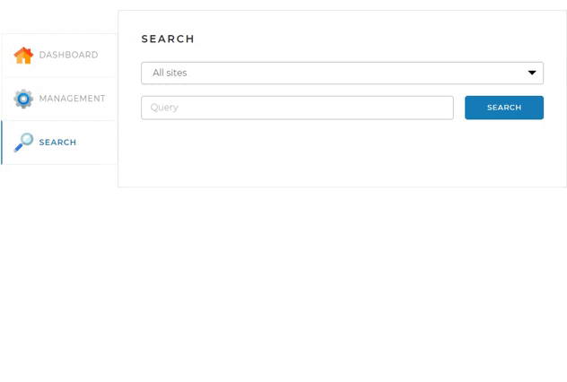

# Локальный поисковый движок

## Описание работы 
Приложение считывает заданный пользователем список сайтов 
из [файла-конфигурации `application.yaml`](#необходимые-настройки).

Затем происходит перебор страниц каждого сайта для сохранения текущей версии html-кода,
парсинга, поиска лемм в текстовых элементах 
и создания поискового индекса в Базе Данных (далее - БД) каждой страницы.

## Системные требования 
- [Java 17](https://www.oracle.com/java/technologies/downloads/#java17)
- [Maven 4.0](https://maven.apache.org/download.cgi#system-requirements-1)
- [БД MySQL](https://www.mysql.com/downloads/)
- Browser

## Спецификация API
Приложение реализует следующие команды API:

### `GET` `/api/statistics` — Статистика
Метод возвращает статистику о состоянии поискового индекса в текущий момент.  
Статистика отражает общее количество данных накопленных в БД и детализацию по каждому сайту.
Используется для формирования стартовой страницы Веб-интерфейса.

### `GET` `/api/startIndexing` — Запуск полной индексации
Метод запускает полную индексацию всех сайтов, указанных в 
[`application.yaml`](#необходимые-настройки), или полную переиндексацию, если они уже 
проиндексированы.  
Если в настоящий момент индексация (переиндексация) уже запущена, 
метод возвращает соответствующее сообщение об ошибке.

### `GET` `/api/stopIndexing` — Остановка текущей индексации
Метод останавливает текущий процесс индексации (переиндексации).  
Если в настоящий момент индексация (переиндексации) не происходит, 
метод возвращает соответствующее сообщение об ошибке.

### `POST` `/api/indexPage` — Добавление или обновление отдельной страницы
Метод добавляет в индекс или обновляет отдельную страницу, адрес которой передан в параметре.  
Если страница уже была проиндексирована, то сначала данные соответствующего url будут удалены,
и индексация будет запущена заново.  
Если адрес страницы передан неверно, метод возвращает соответствующую ошибку.

### `GET` `/api/search` — Получение данных по поисковому запросу
Метод осуществляет поиск страниц по переданному поисковому запросу `query`.  
***Параметры:***  
`query` — поисковый запрос;  
`site` — сайт, по которому осуществлятся поиск (если не задан, поиск происходит 
по всем проиндексированным сайтам);  
`offset` — сдвиг от 0 для постраничного вывода (необязательный, по умолчанию - 0);  
`limit` — количество результатов, которое необходимо вывести (необязательный, по умолчанию - 10).


## Веб-интерфейс
Функции приложения разделены между
тремя вкладками веб-интерфейса:

### Dashboard
Отображает общую статистику по количеству проиндексированных сайтов, страниц и найденных 
в их тексте лемм.  
По каждому из сайтов доступна детализированная информация в выпадающем меню.  

[//]: # (![Dashboard]&#40;images/d.gif "Dashboard"&#41;)


### Management

- Позволяет запустить или остановить индексацию по всем сайта, заданным в `application.yaml`.
- Позволяет проиндексировать/переиндексировать отдельно взятую страницу.

[//]: # (![Management]&#40;images/m.gif "Management"&#41;)


### Search
   Позволяет выполнить текстовый поиск по отдельно выбранному или всем проиндексированным сайтам.
   Результаты выводятся списком в виде ссылок и фрагментов исходного текста страниц.

[//]: # ([//]: # &#40;![Search]&#40;images/s.gif "Search"&#41;&#41;)



## Подготовка и запуск приложения
1. Выберите корневую директорию проекта (далее - `/project`) и склонируйте в неё файлы проекта удобным для вас способом.  
   При клонировании с помощью Git Bash перейдите в `/project` с помощью команд `cd` и `ls`.  
   Далее выполните команду:  
   `git clone https://github.com/eduardich/Search-Engine.git`.
2. Заполните файл конфигурации `application.yaml`, используя [описание](#необходимые-настройки) ниже.
3. Если БД MySQL ещё не установлена, можете воспользоваться инструкцией по установке [MySQL в Docker](#подключение-к-бд-mysql-в-docker-контейнере).
4. Убедитесь, что у вас установлен Maven выполнив команду `mvn -v`.  
   Если команда не распознается системой, то воспользуйтесь
   [инструкцией по установке  Maven](https://maven.apache.org/install.html).
5. Работая в `/project`, запустите компиляцию проекта командой `mvn compile`
6. Запустите скомпилированный код
   ```
   mvn exec:java -Dexec.mainClass="com.example.search_engine.SearchEngineApplication"
   ```
7. Введите в адресной строке браузера соответствующий IP, порт и путь.  
   Например, `localhost:8080/admin`.

Перед вами откроется Веб-интерфейс.
Спасибо, что проявили интерес к данному проекту!


## Необходимые настройки
Файл конфигурации `application.yaml` находится в корневой директории проекта.  
Для настройки работы приложения в нём необходимо выполнить 
следующие настройки:

### 1. Установить порт для доступа к веб-интерфейсу
```yaml
server:
  port: 8080
```
### 2. Установить параметры доступа к БД - url, username, password, driven-class-name
```yaml
spring:
  datasource:
    url: jdbc:mysql://localhost:3306/search?createDatabaseIfNotExist=true&useSSL=false&useUnicode=true
    username: root
    password: MySQL
    driver-class-name: com.mysql.cj.jdbc.Driver
```

#### - `url`
Укажите url адрес соединения в формате:  
`jdbc:[sqlserver]://[IP-address][:portNumber]/[scheme]?[property=value]&[property=value]...`

Рекомендованные параметры url:  
`?createDatabaseIfNotExist=true&useSSL=false&useUnicode=true`.


#### - `username`, `password`
Данные необходимые для подключения к БД.

#### - `driver-class-name`
В случае работы с MySQL следует оставить без изменений.

### 3. Установить пользовательскую конфигурацию
Необходимо заполнить данные
```yaml
user-config:
  jsoup-connection-properties:
    user-agent: Mozilla/1.0 (Windows NT 10.0; Win64; x64) AppleWebKit/537.36 (KHTML, like Gecko) Chrome/106.0.0.0 Safari/537.36
    referrer: http://www.google.com
  web-interface-path: /admin
```
#### - `user-agent`, `referrer`
Используются в html заголовках при обходе страниц сайтов.
#### - `web-interface-path`
Задать, если есть необходимость иметь доступ к веб-интерфейсу по специальному адресу,  
например `http://localhost:8080/admin`.
### 4. Установить список сайтов
Необходимо задать список сайтов, индексация которых будет запускаться 
по команде из вкладки [Management](#user-content-management) веб-интерфейса.
```yaml
user-config:
  site-attributes:
    - url: https://dombulgakova.ru
      name: Дом Булгакова
    - url: https://et-cetera.ru/mobile/
      name: Театр ET CETERA
        ...
```


## Подключение к БД MySQL в Docker контейнере 
Команда для установки необходимого [Docker контейтнера](https://hub.docker.com/_/mysql)

```
docker pull mysql:latest
```

Команда для запуска Docker контейнера

```
docker run --name mysqltest -p 3306:3306 -p 33060:33060 -e MYSQL_ROOT_PASSWORD=1234 -e MYSQL_DATABASE=search -d mysql:latest
```

После выполнения команды выше, для подключения приложения к БД, в `application.yaml` необходимо
указать следующие данные:
```yaml
spring:
  datasource:
    username: root
    password: 1234
```

В целях тестирования к опциям [url](#--url) следует добавить  
`allowPublicKeyRetrieval=true`


